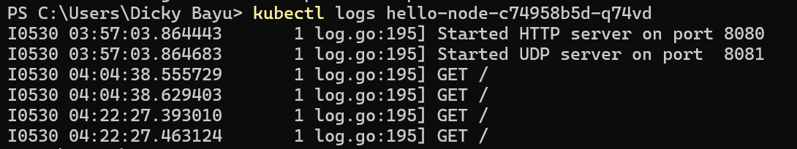
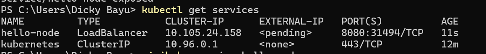
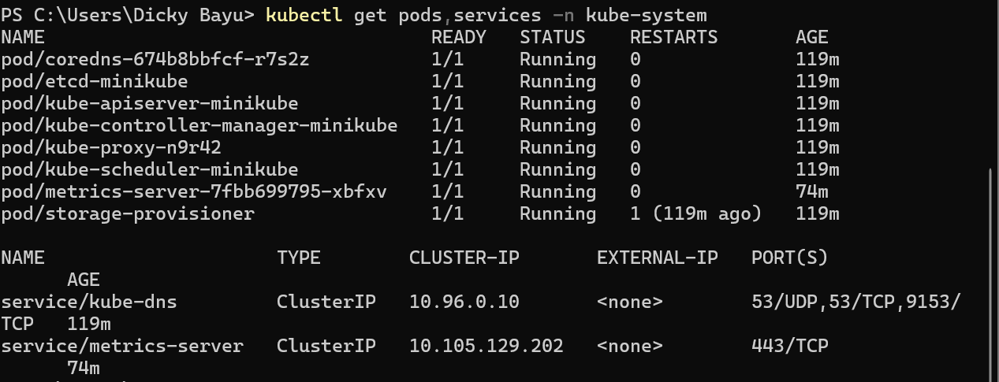
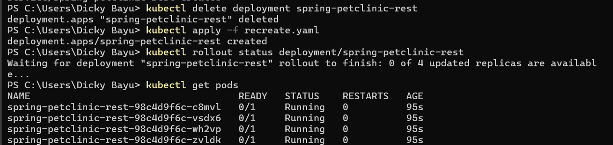

# Reflection: Hello Minikube - Advanced Programming Module 11

## 1. Compare the application logs before and after exposing it as a Service

Before exposing the application as a Service, the logs only showed startup messages such as:


After exposing the app using `kubectl expose` and running `minikube service hello-node`, I accessed the app through the browser multiple times. The logs increased with entries like:



This shows that every time the app was opened in the browser, a new log entry appeared. This means the Service successfully exposed the Pod to external traffic, and each incoming request was logged by the container.


## 2. What is the purpose of the `-n` option in `kubectl get`?

Using `kubectl get` without the `-n` flag shows resources from the **default namespace**, which is where my `hello-node` deployment and service were created by default.



When I used:
kubectl get pods,services -n kube-system



it only showed system-managed components like metrics-server, kube-dns, etcd, and kube-apiserver.

That's because those resources belong to the kube-system namespace, not the default one.

In short, the -n flag lets me choose which namespace I want to look at, and that’s why I didn’t see my app when querying the kube-system namespace.

# Reflection: Rolling Update & Kubernetes Manifest File - Advanced Programming Module 11

## 3. What is the difference between Rolling Update and Recreate deployment strategy?

The Rolling Update strategy, which is the default in Kubernetes, gradually replaces old Pods with new ones. This approach allows the application to remain available during the update process, ensuring zero downtime. It is well-suited for production environments where high availability is critical. On the other hand, the Recreate strategy stops all existing Pods before new ones are created. This causes a period of downtime, making it less ideal for live systems, but it is simpler and can be more appropriate in situations where the new version of the application cannot run concurrently with the old one, such as when there are breaking changes or shared state issues.

## 4. Deploying Spring Petclinic REST using Recreate Strategy

I deleted the existing deployment using kubectl delete deployment spring-petclinic-rest, and then applied a new manifest file named recreate.yaml that uses the Recreate strategy. This strategy ensures that all old pods are deleted before new ones are created, which causes a short downtime but simplifies the update process. I applied the manifest using:

```kubectl apply -f recreate.yaml```

hen, I monitored the rollout with:

```kubectl rollout status deployment/spring-petclinic-rest```

Finally, I checked the pod status with:

```kubectl get pods ```

All new pods were created and running as expected with no old pods remaining. This confirmed that the Recreate strategy was executed successfully.




## 5. Manifest Files for Recreate Strategy

```yaml
apiVersion: apps/v1
kind: Deployment
metadata:
  labels:
    app: spring-petclinic-rest
  name: spring-petclinic-rest
  namespace: default
spec:
  progressDeadlineSeconds: 600
  replicas: 4
  revisionHistoryLimit: 10
  selector:
    matchLabels:
      app: spring-petclinic-rest
  strategy:
    type: Recreate
  template:
    metadata:
      labels:
        app: spring-petclinic-rest
    spec:
      containers:
      - image: docker.io/springcommunity/spring-petclinic-rest:3.2.1
        imagePullPolicy: IfNotPresent
        name: spring-petclinic-rest
        ports:
        - containerPort: 8080
        resources: {}
        terminationMessagePath: /dev/termination-log
        terminationMessagePolicy: File
      dnsPolicy: ClusterFirst
      restartPolicy: Always
      schedulerName: default-scheduler
      securityContext: {}
      terminationGracePeriodSeconds: 30

```

changes that i made 

```yaml
    ...
    strategy:
        type: Recreate
    ...
```

## 6. What do you think are the benefits of using Kubernetes manifest files? Recall your experience in deploying the app manually and compare it to your experience when deploying the same app by applying the manifest files (i.e., invoking `kubectl apply -f` command) to the cluster.

Using Kubernetes manifest files made the deployment process much easier and more organized. Compared to doing everything manually with kubectl commands, applying the manifest with just kubectl apply -f handled everything at once based on what I had already defined.

One of the biggest advantages is that all the configurations are stored in YAML files, so I can redeploy or modify things easily without repeating every step. This also makes it more convenient to work in teams because everything is clear and version-controlled in Git. For example, when I changed the deployment strategy from RollingUpdate to Recreate, I just updated the strategy field in the manifest and re-applied it , no need to figure out each step again.

When I first deployed manually, I had to go through each step: creating the deployment, exposing the service, checking the pods, and so on. But with the manifest, all of that was handled automatically, including setting the replica count and container image. It definitely saved time and reduced the chance of mistakes.
